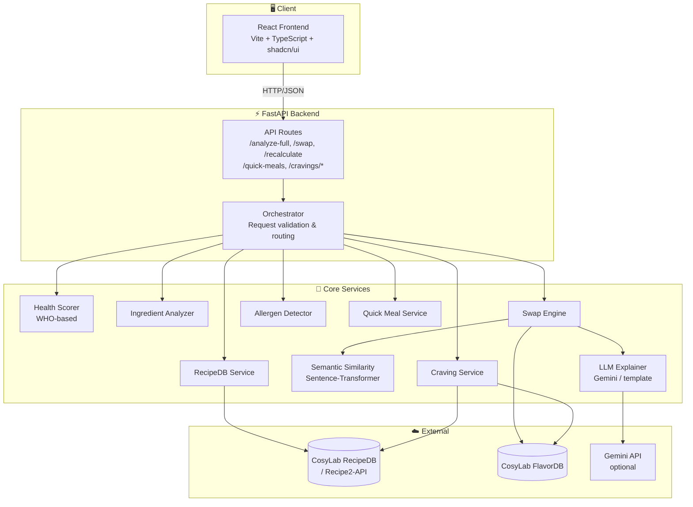

# 🥗 NutriTwin

**A full-stack recipe health analysis and ingredient swap platform** that scores meals against WHO nutrition guidelines and recommends healthier ingredient substitutions using rule-based logic, semantic search, and LLM reasoning.

NutriTwin also includes a **Hyper-Personalized Craving Replacement System** — log a craving and get psychology-backed, flavor-matched healthy alternatives instead of willpower-based restriction.

---

## Table of Contents

- [Overview](#overview)
- [Architecture](#architecture)
- [Tech Stack](#tech-stack)
- [Core Features](#core-features)
  - [1. Recipe Health Analysis](#1-recipe-health-analysis)
  - [2. WHO-Based Health Scoring](#2-who-based-health-scoring)
  - [3. Ingredient Swap Engine](#3-ingredient-swap-engine)
  - [4. Craving Replacement System](#4-craving-replacement-system)
- [Fallback & Resilience Design](#fallback--resilience-design)
- [API Reference](#api-reference)
- [Data Sources](#data-sources)
- [Database Schema](#database-schema)
- [Known Limitations](#known-limitations)
- [Roadmap](#roadmap)
- [Troubleshooting](#troubleshooting)

---

## Overview

NutriTwin lets a user type in a recipe name (or paste their own ingredients) and get back:

- An **overall health score (0–100)** based on WHO nutrition guidelines
- A list of **risky ingredients** (high sugar, sodium, saturated fat, ultra-processed, etc.)
- **Ranked ingredient swap suggestions** with a projected improved score
- A **plain-language explanation** of why each swap helps (LLM-generated or templated)
- Optionally, a **craving replacement flow** — log what you're craving, why, and when, and get quick combos + full recipes that satisfy the same flavor profile in a healthier way

The system is designed to **degrade gracefully**: even when external APIs are down, users still get a complete, useful analysis via local rule engines and LLM fallback — never an error page.

---

## Architecture
The system is a **full-stack recipe health analysis and ingredient swap** application: 
a React/Vite frontend talks to a FastAPI backend, which orchestrates CosyLab APIs (RecipeDB, FlavorDB), 
local rule-based engines, and optional LLM (Gemini) for explanations and swap suggestions. 




**ASCII view (no Mermaid):**

```
  [React Frontend]  ----HTTP---->  [FastAPI: /analyze-full, /recalculate, /cravings, /quick-meals]
                                            |
                    +-----------------------+-----------------------+
                    |                       |                       |
              [RecipeDB Svc]         [Health Scorer]         [Ingredient Analyzer]
                    |                       |                       |
                    v                       v                       v
              [CosyLab APIs]           (WHO score)            (risky list)
                    |                       |                       |
                    +-----------------------+-----------------------+
                                            |
                                    [Swap Engine] ----> [FlavorDB] (fallback: HEALTHY_SWAPS)
                                            |
                            +---------------+---------------+
                            |               |               |
                    [Semantic Rerank]  [LLM Explainer]  [Projected Score]
                    (all-MiniLM-L6-v2) (Gemini/template)
                                            |
                                            v
                              [FullAnalysisResponse: score, swaps, explanation]
```

### Component Responsibility Matrix

| Component | Responsibility | Data Source | Status |
|-----------|-----------------|--------------|--------|
| **RecipeDB Service** | Recipe metadata (legacy endpoints) | CosyLab RecipeDB | ⚠️ Mostly deprecated |
| **Recipe2-API Service** | Recipe search by title, ingredient fetching | CosyLab Recipe2-API | ✅ Working |
| **FlavorDB Service** | Flavor profiles, molecule similarity, pairings | CosyLab FlavorDB | ❌ API down (404) |
| **Health Scorer** | WHO-based scoring, macro balance, penalties | Local calculation | ✅ Working |
| **Ingredient Analyzer** | Risky-ingredient detection via keywords + nutrition thresholds | Local rules | ✅ Working |
| **Swap Engine** | Multi-source swap generation, ranking | HEALTHY_SWAPS + FlavorDB (fallback) | ✅ Working (degraded) |
| **Sentence Transformer** | Semantic re-ranking of swap candidates | `all-MiniLM-L6-v2` (local) | ✅ Working |
| **LLM Explainer** | Swap explanations with molecule evidence | Gemini API (optional) | ✅ Working |
| **Craving Service** | Mood-based recipe recommendations | RecipeDB + FlavorDB | ⚠️ Partial (FlavorDB down) |

---

## Tech Stack

**Frontend**
- React + TypeScript
- Vite
- shadcn/ui

**Backend**
- Python
- FastAPI
- Pydantic (request/response schemas)

**ML / NLP**
- Sentence-Transformers (`all-MiniLM-L6-v2`) — local semantic re-ranking, no external calls
- Gemini API — optional LLM explanations and swap agent
- *(Planned)* Zero-shot classifiers (`deberta-v3-base-zeroshot` / `bart-large-mnli`) and `flan-t5-small` as local transformer replacements for the LLM layer

**External APIs**
- CosyLab RecipeDB / Recipe2-API — recipe search, ingredients, nutrition
- CosyLab FlavorDB — flavor profiles, molecule pairings

**Data & Persistence**
- PostgreSQL — recipe cache, analysis logs, API health tracking
- Browser `localStorage` — craving history persistence (client-side)

**Architecture Patterns**
- Service-oriented orchestration
- Try-primary/except-fallback resilience routing (never parallel LLM + API calls)
- Data-driven configuration (mapping tables instead of hardcoded logic)

---

## Core Features

### 1. Recipe Health Analysis

**Flow for `POST /analyze-full`:**

1. Resolve recipe + ingredients (RecipeDB/Recipe2-API lookup or user-provided)
2. Fetch or estimate nutrition data
3. Compute WHO-based health score
4. Detect allergens and user avoid-list matches
5. Identify risky ingredients
6. Generate swap suggestions (rule-based + FlavorDB, or LLM agent as fallback)
7. Re-rank swaps locally with sentence-transformers
8. Project the improved score and build a natural-language explanation

**Ingredient fetching challenge:** Recipe2-API returns only **one ingredient per recipe per search request**. NutriTwin works around this with a **multi-query strategy** — searching individual title words and word-pair permutations (capped at 12 queries) and collecting matching rows — typically yielding **3–8 ingredients per recipe** instead of 1.

### 2. WHO-Based Health Scoring

Scores are built from WHO daily reference values (sugar, saturated fat, trans fat, sodium, fiber, protein), normalized **per serving**.

```
BASE_SCORE = 100

- sugar_penalty       (0–20)
- sat_fat_penalty     (0–20)
- trans_fat_penalty   (0–20)
- sodium_penalty      (0–20)
- processed_penalty   (0–25)
+ fiber_bonus         (0–15)
+ whole_grain_bonus   (0–5)
+ plant_diversity     (0–5)

FINAL_SCORE = clip(HEALTH_SCORE, 0, 100)
```

Risky ingredients are flagged via **keyword matching** (six categories: ultra-processed, refined sugar, high sodium, high saturated fat, trans fat, artificial additives) **OR** nutrition thresholds (e.g. sugar > 15g, sodium > 400mg, sat fat > 5g per serving).

A companion **Potential Profile** calculates the theoretical best score achievable if every risky ingredient were optimally swapped, along with an "improvement headroom" percentage.

### 3. Ingredient Swap Engine

For each risky ingredient:

1. Normalize the name (strip quantities/prep words — e.g. `"3 tablespoons butter, divided"` → `"butter"`)
2. Gather candidates from:
   - `HEALTHY_SWAPS` dictionary (130+ ingredient entries, always available)
   - FlavorDB flavor pairings (molecule-aware, currently unavailable — gracefully degrades)
3. Filter out ingredients already in the recipe
4. Rank the top 5 by:

```
rank_score = (flavor_match × 0.5) + (health_improvement × 0.4) + (semantic_similarity × 0.1)
```

5. Extract shared flavor molecules for explainability (top 8, empty while FlavorDB is down)
6. Recalculate projected nutrition using baseline injection + proportional adjustment (prevents zero-multiply errors when API nutrition data is sparse)

Typical result: **+5 to +15 point** health score improvement per accepted swap set.

### 4. Craving Replacement System

A dedicated **Cravings** tab built on the psychological principle that **cravings are emotional, not nutritional** — the system never says "don't eat X," it always offers a flavor-matched substitution.

| Input | Options |
|-------|---------|
| Flavor type | sweet, salty, crunchy, spicy, umami, creamy |
| Mood | stressed, bored, tired, happy, anxious, sad |
| Time of day | morning, afternoon, evening, late-night |
| Context | free text (e.g. "after studying") |

**Output:**
- Psychological insight (why the craving is happening)
- Up to 3 quick ingredient combos (FlavorDB molecule matching, <5 min prep)
- Up to 5 full recipe suggestions (RecipeDB, ranked by health score)
- Science explanation of why the swap satisfies the same craving
- Encouragement message

Over time, `POST /cravings/patterns` analyzes craving history (stored client-side in `localStorage`) to surface behavioral patterns (e.g. *"you crave sweet foods late at night when stressed"*) and weekly stats, shown on both the Cravings page and Dashboard.

All craving logic — flavor-to-category mapping, time-of-day mapping, mood associations, insight templates — lives in **data-driven constant tables**, so new flavors/moods/insights can be added without code changes.

---

## Fallback & Resilience Design

NutriTwin is built around **strict sequential fallback** — never parallel LLM + API execution:

```python
# WRONG
if USE_LLM: llm_run() else cosylab_run()

# RIGHT
try:
    cosylab_run()
except CosyLabUnavailable:
    llm_run()
```

**CosyLab failure is detected on:**
- `None` responses
- Timeouts
- HTTP 401 / 403 / 429 / 500 / 502 / 503
- Empty or error-containing JSON bodies

**On failure, the system falls back to:**
- LLM-estimated nutrition
- LLM-inferred risky ingredients
- LLM-proposed swaps
- Sentence-transformer re-ranking still runs locally regardless of which path was taken

This ensures the user **always receives a complete `FullAnalysisResponse`**, sourced from either `"cosylab"` or `"llm_fallback"`.

---

## API Reference

### Recipe Analysis

| Endpoint | Method | Description |
|----------|--------|-------------|
| `/analyze-full` | POST | Full recipe health analysis: score, risky ingredients, swaps, explanation |
| `/recalculate` | POST | Recalculate score after user accepts/rejects swaps |
| `/quick-meals` | POST | Filtered quick recipe search |
| `/health` | GET | Reports CosyLab (RecipeDB/FlavorDB) API availability |
| `/debug/cosylab-test` | GET | Returns exact request URL, headers (redacted), params, and raw response for debugging |

### Cravings

| Endpoint | Method | Description |
|----------|--------|-------------|
| `/cravings/replace` | POST | Convert a logged craving into quick combos + full recipe suggestions |
| `/cravings/patterns` | POST | Analyze craving history for behavioral patterns and weekly stats |

**Example — `/analyze-full` response (abridged):**

```json
{
  "source": "cosylab",
  "ingredients": ["butter", "cashews", "salt"],
  "original_health_score": { "score": 27.92, "rating": "Bad" },
  "risky_ingredients": [
    { "name": "butter", "category": "high_fat" }
  ],
  "swap_suggestions": [
    {
      "original": "butter",
      "substitute": { "name": "olive oil", "flavor_match": 0.0, "health_improvement": 40.0 },
      "alternatives": [{ "name": "olive oil" }, { "name": "ghee" }, { "name": "avocado" }]
    }
  ],
  "improved_health_score": { "score": 37.92, "rating": "Bad" },
  "score_improvement": 10.0
}
```

---

## Data Sources

### CosyLab RecipeDB (legacy)

Base: `https://cosylab.iiitd.edu.in/recipedb/search_recipedb` — largely superseded by Recipe2-API; endpoints like `recipe_by_title`, `recipe_nutrition_info`, `recipe_by_id`, `recipe_by_cuisine`, `recipe_by_diet`, `recipe_by_calories`, etc. remain defined but are mostly returning errors.

### CosyLab Recipe2-API (primary)

Base: `https://cosylab.iiitd.edu.in/recipe2-api`
`GET /recipebyingredient/by-ingredients-categories-title` — primary recipe search; used with the multi-query strategy described above.

### CosyLab FlavorDB

Base: `https://cosylab.iiitd.edu.in/flavordb` — **currently returning 404 on all endpoints** (`entities_by_readable_name`, `flavor_pairings`, `molecules_by_flavor_profile`, `molecules_by_common_name`, plus extended endpoints for functional groups, molecular weight, PSA, HBD/HBA, aroma/taste thresholds, and regulatory info). All swap logic degrades to the local `HEALTHY_SWAPS` dictionary while this is down.

### Gemini API (optional)

Used for LLM-based swap explanations and, on CosyLab failure, heuristic nutrition estimation, risky-ingredient inference, and swap proposals. Falls back to templates when no API key is configured or the call fails.

---

## Database Schema

```sql
-- Recipe cache (reduce CosyLab calls)
CREATE TABLE recipe_cache (
    id UUID PRIMARY KEY,
    recipe_name VARCHAR(255) UNIQUE NOT NULL,
    cosylab_recipe_id VARCHAR(64),
    ingredients JSONB,
    nutrition JSONB,
    micro_nutrition JSONB,
    fetched_at TIMESTAMPTZ,
    expires_at TIMESTAMPTZ
);

-- Analysis results (audit / ML)
CREATE TABLE analysis_log (
    id UUID PRIMARY KEY,
    recipe_name VARCHAR(255),
    source VARCHAR(16),  -- 'cosylab' | 'llm_fallback'
    health_score FLOAT,
    health_profile JSONB,
    potential_profile JSONB,
    swap_suggestions JSONB,
    created_at TIMESTAMPTZ
);

-- API availability tracking
CREATE TABLE api_health (
    id UUID PRIMARY KEY,
    api_name VARCHAR(32),  -- 'recipedb' | 'flavordb'
    status VARCHAR(16),    -- 'ok' | 'fail'
    response_time_ms INT,
    error_message TEXT,
    checked_at TIMESTAMPTZ
);
```

---

## Known Limitations

| # | Limitation | Impact | Mitigation |
|---|------------|--------|------------|
| 1 | **FlavorDB API down (404 on all endpoints)** | No molecule-aware flavor matching; `flavor_match` = 0%, `shared_molecules` = [] | Falls back to `HEALTHY_SWAPS` dictionary |
| 2 | **Recipe2-API returns 1 ingredient per search** | Incomplete/variable ingredient lists (3–8 of ~15–20 actual) | Multi-query word-permutation strategy (capped at 12 queries) |
| 3 | **Limited nutrition fields from API** | Only calories, protein, and fat are reliably available; no carbs/sodium/cholesterol/vitamins | Baseline injection prevents zero-multiply errors; sat fat estimated as 50% of total fat |
| 4 | **Micronutrient scoring disabled** | Effective score range is 0–70 instead of 0–100 | Documented; flagged in health profile output |

**Production readiness: ⚠️ Partially ready** — core analysis, scoring, and swap generation work end-to-end; full production requires CosyLab FlavorDB restoration and richer nutrition data.

---

## Roadmap

- [ ] Contact CosyLab support to verify/restore FlavorDB endpoints
- [ ] Document Recipe2-API ingredient-sampling limitation in the UI ("Sample ingredients shown")
- [ ] Add manual ingredient entry fallback for complete analysis
- [ ] Client-side caching to reduce multi-query API load
- [ ] **Replace Gemini dependency with local transformer models:**
  - `all-MiniLM-L6-v2` for swap re-ranking (already local)
  - `deberta-v3-base-zeroshot-v2.0` or `bart-large-mnli` for zero-shot risky-ingredient classification (replacing keyword matching)
  - `flan-t5-small` for templated one-sentence explanations
  - Goal: fully offline-capable core pipeline with no external LLM dependency

---

## Troubleshooting

**"RecipeDB / FlavorDB not working"** — check in this order:

1. **Logs** — look for `Making API request to <url>`, `API Response Status: <code>`, and error classifications (`Client error (4xx) - likely API key issue`, `Connection error`, etc.)
2. **`GET /debug/cosylab-test`** — returns the exact request URL, redacted headers, params, and raw response for comparison against a known-working request (e.g. in Postman)
3. **`GET /health`** — reports `recipedb_available: true/false`
4. **`.env`** — confirm `COSYLAB_API_KEY` is set; if using the org API style, set `RECIPEDB_USE_BEARER_AUTH=true`

| Status Code | Likely Cause |
|--------------|--------------|
| 401 / 403 | Missing or wrong API key / auth type |
| 404 | Wrong base URL or endpoint path |
| 5xx | CosyLab server issue (auto-retried up to `max_retries`) |
